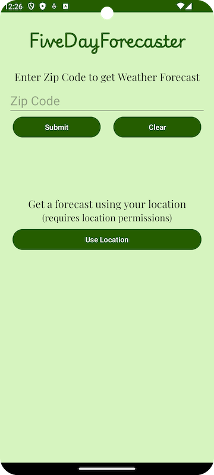
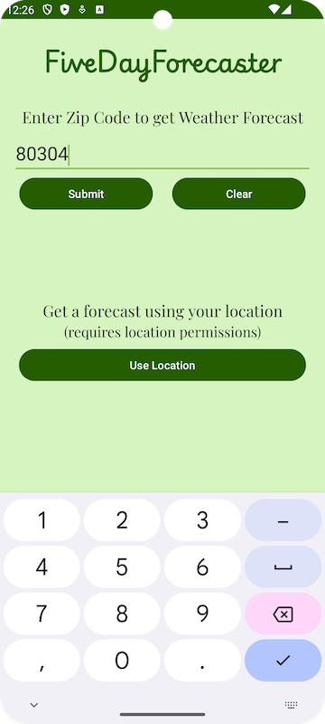
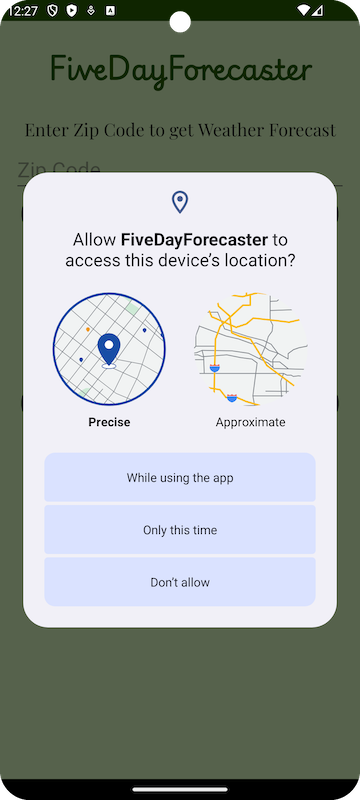
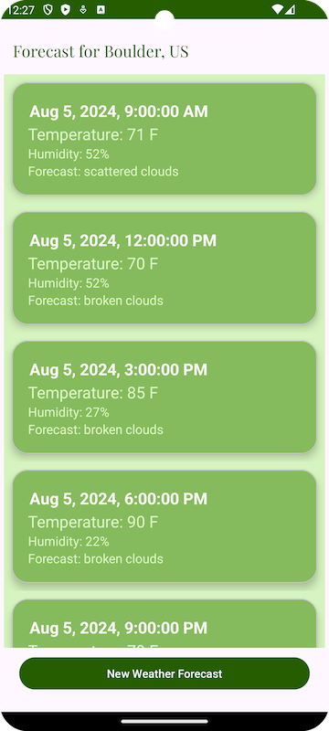
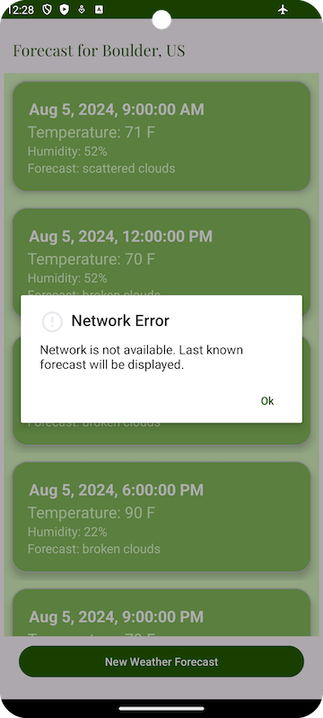
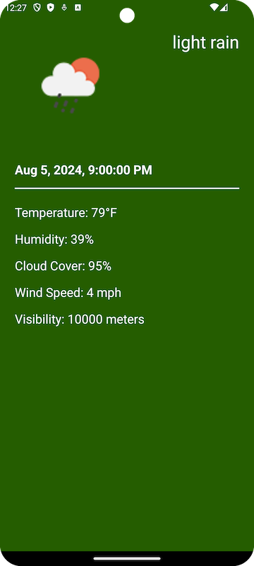

# FiveDayForecaster

## Overview (Getting Started)

**FiveDayForecaster** is a simple app that retrieves weather predictions for every three hours
spanning five days. To run this app you should use Android Gradle Plugin version 8.4.0, Gradle version 8.9, 
and JDK 17.

#### Dependencies

This project uses the following dependencies:
- AndroidX (core ktx, appcompat)
- AndroidX activity
- Google material
- Google gson
- Google play services location
- AndroidX (constraint layout, cardview, recyclerview)
- Squareup picasso
- AndroidX navigation (fragment ktx, ui ktx)
- AndroidX room (runtime, ktx, testing, compiler)
- Koin (core, android)
- Ktor (core, android, serialization)

Plugins:
- KSP
- Kotlin version 1.9.23
- Jetbrains parcelize
- AndroidX safeArgs

## Project Walkthrough

**FiveDayForecaster** is a three screen app that uses the user's location to retrieve a five day 
weather forecast for that location. The first screen is a location input screen that allows the 
user to either enter a zip code _or_ use the device's hardware (with permission) to retrieve a 
weather forecast from the OpenWeatherMap APIs. Once the user clicks into the zip code entry field,
a numbers-only keyboard appears for the user to use for data entry. The user can then click
the 'Submit' button to use that zip code or the 'Clear' button to clear their entry.

Also on this screen is a 'Use Device Location' button, which allows the user to use the device's
hardware to determine the location. Clicking this button triggers a location permission check. If
permissions have not yet been granted, a dialog appears for the user to enter their permission.
After the user enters either a zip code or uses the device's location, a List Screen appears
which indicates the location of the weather forecast at the top, weather predictions
for every three hours in a scrollable list, and a 'New Weather Forecast' button which allows the 
user to initiate a new search.

Clicking on any of the items in the scrollable list navigates the user to a detail page which
contains more information about that specific time's weather prediction, including cloud cover 
percentage, wind speed, and visibility. An icon image is loaded that represents that weather
prediction.

If, for some reason, the device loses network access, the app defaults to the forecast which is 
stored in the local database (Room) and shows the user a dialog which explains that there was a 
network issue.

## Rubric

Here I will explain where each item in the Rubric is implemented.

#### Android UI/UX

_"Build a navigable interface consisting of multiple screens of functionality and data"_

- application contains three screens: WeatherLocationFragment, WeatherListFragment, and
WeatherDetailFragment. I am using a navigation.xml file to define the navigation between
Fragments.
- a Navigation Controller is used for navigation between Fragments, as seen in MainActivity and
navigation.xml.
- I am using bundles to pass information between Fragments (a zip code String between the
WeatherLocationFragment and the WeatherListFragment, a WeatherEntity object between the
WeatherListFragment and the WeatherDetailFragment).

_"Construct interfaces that adhere to Android standards and display appropriately on screens of
different sizes and resolution"_

- I am using ConstraintLayout in fragment_weather_location.xml, fragment_list_weather.xml, and
fragment_weather_detail.xml.
- I am displaying the data that was retrieved from the API in a RecyclerView in the
WeatherListFragment in an easily consumable layout.
- My res directory contains colors.xml, dimens.xml, strings.xml, and themes.xml files as well as
a drawables directory which contains launcher icons as well as miscellaneous images used 
throughout the app.
- All Views in my layout files contain id fields and at least one vertical constraint.
- Data retrieved from the API is loaded using the ViewHolder pattern and a RecyclerView.

#### Local & Network Data

_"Connect to and consume data from a remote data source such as a RESTful API"_

- The app retrieved remote data from the OpenWeatherMap API using Ktor.
- Once the app retrieves the remote data it is stored in a local database using Room (see
WeatherRepository, LocalDataSource, RemoteDataSource, WeatherDAO, and WeatherDatabase). I am
using Google's Gson library to deserialize the json that is downloaded from the API into a list
of WeatherEntity objects, which are then stored in the local database.
- I am using Kotlin Coroutines and IO/Main threads to perform asynchronous work (see 
WeatherListFragment, WeatherRepository).

_"Load network resources, such as Bitmap Images, dynamically and on-demand"_

- In WeatherDetailFragment, I am using Picasso to load a weather icon image from a URL that is 
provided by the API. 
- I have a default placeholder image in the Picasso implementation that is shown while the
remote image is being loaded.
- Picasso uses a background thread by default.

_"Store data locally on the device for use between application sessions and/or offline use"_

- I use Room to store the five day forecast and the location of the weather report in two tables.
The UI collects changes to this database via Kotlin Flows.
- The data that is stored locally is accessible across user sessions.
- I am using Kotlin Coroutines to perform all storage of data in local databases (see suspend
functions in LocalDataSource, WeatherRepository, etc).
- All data is structured with appropriate data types and scope (see WeatherEntity)

#### Android System & Hardware Integration

_"Architect applicatoin functionality using MVVM"_

- This app uses an MVVM architecture as can be witnessed by the package structure as well as the
classes: App, Activity, Fragment, ViewModel, Model, Repository, LocalDataSource, and 
RemoteDataSource. the Activity/Fragments control the Views, the Models house the data structure,
and the ViewModel controls the business logic.
- I am using the observer pattern to show Toasts (see WeatherLocationFragment) as well as
NavigationCommands (see WeatherLocationFragment, WeatherListFragment).

_"implement logic to handle and respond to hardware and system events that impact the Android 
Lifecycle"_

- The app uses the hardware's location capabilities and requests location permissions when needed
  (specifically when clicking the 'Use Device Location' button.
- LifeCycle events are handled gracefully (e.g. when switching orientations - see WeatherViewModel)

_"utilize system hardware to provide the user with advanced functionality and features"_

- The app uses the device's hardware to get the location of the user.
- Location permission is checked and requested inline when the user uses the "Use Device Location"
button (see WeatherLocationFragment, PermissionsHandler).
- The feature is only accessible once the user grants permission to use the device's location
  (see MainActivity.onRequestPermissionsResult()).
